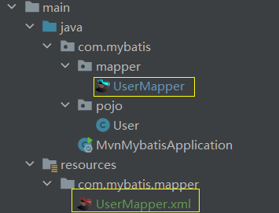

# XML映射

对于复杂的sql语句使用xml映射，对于简单一点的使用注解。

* 规范

XML映射文件的名称与Mapper接口名称一致，并且将XML映射文件和Mapper接口放置在相同包下（同包同名)。 

XML映射文件的namespace属性为Mapper接口全限定名一致。  

XML映射文件中sql语句的id与Mapper接口中的方法名一致，并保持返回类型一致。
* 如


## 栗子
* 二者都是`com.mybatis.mapper.UserMapper`



* xml的约束

从[mybatis中文网](https://mybatis.net.cn/getting-started.html)中“探究一映射的SQL语句复制”
```
<?xml version="1.0" encoding="UTF-8" ?>
<!DOCTYPE mapper
        PUBLIC "-//mybatis.org//DTD Mapper 3.0//EN"
        "http://mybatis.org/dtd/mybatis-3-mapper.dtd">
```

* 然后再添加Mapper

* 其中namespace 要和实现接口全类名相同  `copy Reference`
* `id` 值和要通过xml映射的方法名一致
* `resultType`值和该方法返回单挑封装类型一致, `copy Reference`
* select 标签内放查询语句，对应的update放更新语句，delete放删除语句
```
<mapper namespace="com.mybatis.mapper.UserMapper">
    <!-- 单条记录所封装的类型 -->
    <select id="listXml" resultType="com.mybatis.pojo.User">
        select * from worker_info where name like concat('%', #{name}, '%')
                                    and gender = #{gender} and age >= #{minAge};
    </select>

</mapper>
```


