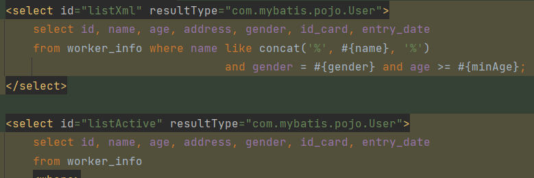
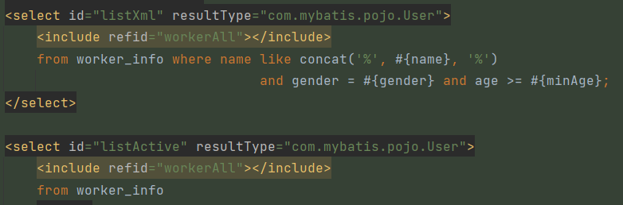

# 动态SQL

随着用户输入或外部条件变化而变化的sql语句

## `<where>  <if>`
```xml
    <select id="listActiveXml" resultType="com.mybatis.pojo.User">
        select * from worker_info
        <where>
            <if test="name != null">
                name like concat('%', #{name}, '%')
            </if>
            <if test="gender != null">
                and gender = #{gender}
            </if>
            <if test="age != null">
                and age >= #{age}
            </if>
        order by age Desc;
        </where>
    </select>
```
各字段不为空时才会相应自动组成一个正确的where语句

比如当name为空时组成的sql语句为：
```mysql
select *
from worker_info
where gender = #{gender}
    and age >= #{age}
order by age Desc;
```
当gender为空时, 组成的sql语句为：
```mysql
select *
from worker_info
where name like concat('%', #{name}, '%')
    and age >= #{age}
order by age Desc;
```

## `<foreach>`

```xml
<!-- 批量删除数据 -->
<!--
    collection:遍历的集合
    item:遍历出来的元素
    separator: 分隔符
    open:遍历开始前拼接的sql片段
    close:遍历结束后拼接的sql片段
    执行后的sql语句:delete from work_info where id in (id,id,id);
-->
    <delete id="deleteById">
        delete from worker_info where id in
        <foreach collection="ids" item="id" separator="," open="(" close=")">
            #{id}
        </foreach>
    </delete>
```

## `<sql> <include>`

sql：抽取
include：引入

类似于封装复用

封装：
```xml
    <sql id="workerAll">
        select id, name, age, address, gender, id_card, entry_date
    </sql>
```
复用
```xml
<include refid="workerAll"></include>
```
使用前

使用后


